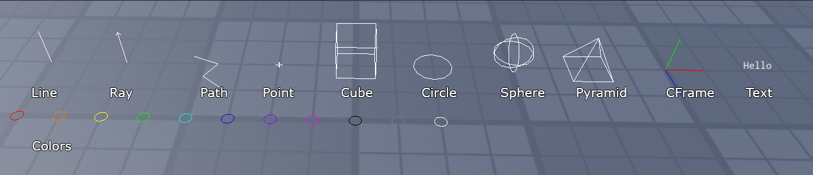

# RobloxGizmos
Roblox plugin to easily draw Gizmos and debug draw shapes and text.



Especially useful to visualize Vector3s, CFrames, points, forces, raycasts and paths during development. Can also be used in experiences.
Extremely performant as it uses a single `WireframeHandleAdornment` and not multiple Instances. The functions can be called from anywhere.

## Instructions:
- place `Gizmos.lua` as a module script anywhere in your project, for example under `ReplicatedStorage`
- in your script, require the module and call the appropriate functions to draw shapes.
```lua
local Gizmos = require(game.ReplicatedStorage.Gizmos)
Gizmos:DrawSphere(Vector3.zero, 1)
```

Note: Gizmos by default are in "_immediate_" mode, meaning that they will clear after drawing each frame. You should draw Gizmos by a callback like `Runservice.Stepped`, which happens every frame:
```lua
game:GetService('RunService').Stepped:Connect(function()
  Gizmos:DrawSphere(Vector3.zero, 1)
end)
```
If instead, you wish to have the gizmos persist between frames, set the `Gizmos.Clear` property to `false`.
```lua
local Gizmos = require(game.ReplicatedStorage.Gizmos)
Gizmos.Clear = false
Gizmos:DrawSphere(Vector3.zero, 1)
```

## Current API
The following methods are currently supported by the module:
```lua
Gizmos:SetColor(color : string | Color3)
Gizmos:DrawLine(from : Vector3, to : Vector3)
Gizmos:DrawRay(origin : Vector3, direction : Vector3)
Gizmos:DrawPath(points : {Vector3}, closed : boolean?, dotsSize : number?)
Gizmos:DrawPoint(position : Vector3, size : number?)
Gizmos:DrawCube(position : Vector3 | CFrame, size : Vector3)
Gizmos:DrawCircle(position : Vector3, radius : number, normal : Vector3?)
Gizmos:DrawSphere(position : Vector3 | CFrame, radius : number)
Gizmos:DrawPyramid(position : Vector3 | CFrame, size : number, height : number)
Gizmos:DrawCFrame(cf : CFrame, size : number?)
Gizmos:DrawText(position : Vector3, text : string, size : number?)
Gizmos:DrawRaycast(origin : Vector3, direction : Vector3, result : RaycastResult)
Gizmos:DrawSpherecast(origin : Vector3, radius : number, direction : Vector3, result : RaycastResult)
Gizmos:DrawBlockcast(cf : CFrame, size : Vector3, direction : Vector3, result : RaycastResult)
Gizmos:AddToPath(name : string, position : Vector3, dotsSize : number?)
Gizmos:Log(...)
```
